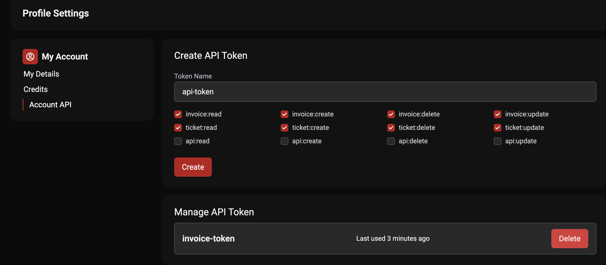
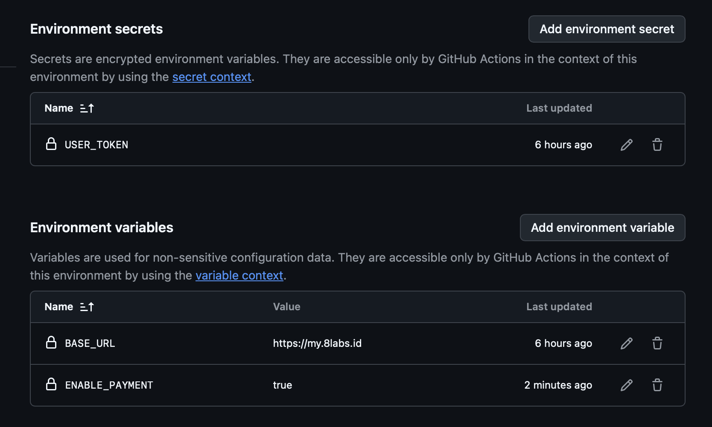

# paymenter-scheduler

# Getting Started

To install dependencies:

```bash
bun install
```

To run:

```bash
bun run index.ts
```

## Create User Token

1. Open this page https://my.8labs.id/api
2. Check invoice and ticket (create, read, update, delete)
3. Click Create



## Setup GitHub Environment Variables

```bash
BASE_URL=https://my.8labs.id
USER_TOKEN=
ENABLE_PAYMENT=true
ENABLE_CREATE_TICKET=true
COOKIE=
```




